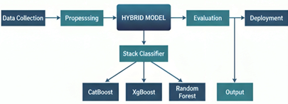
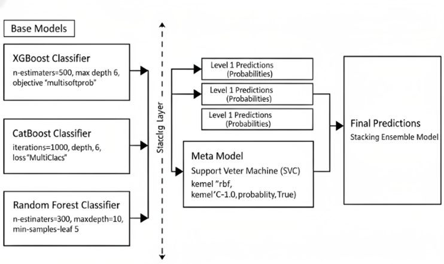
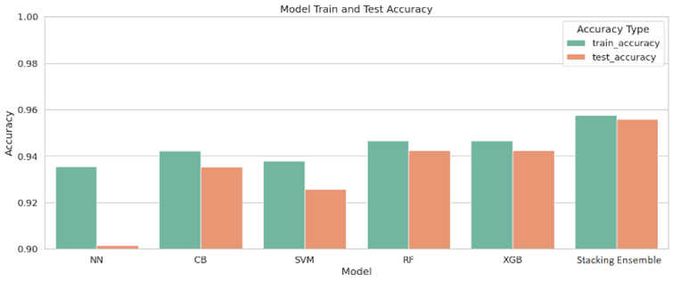
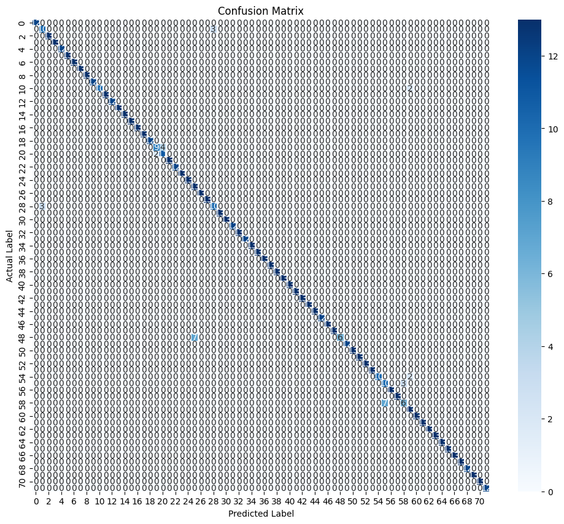
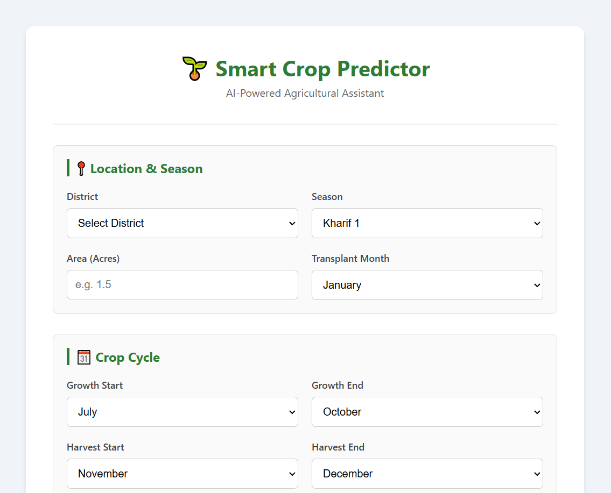
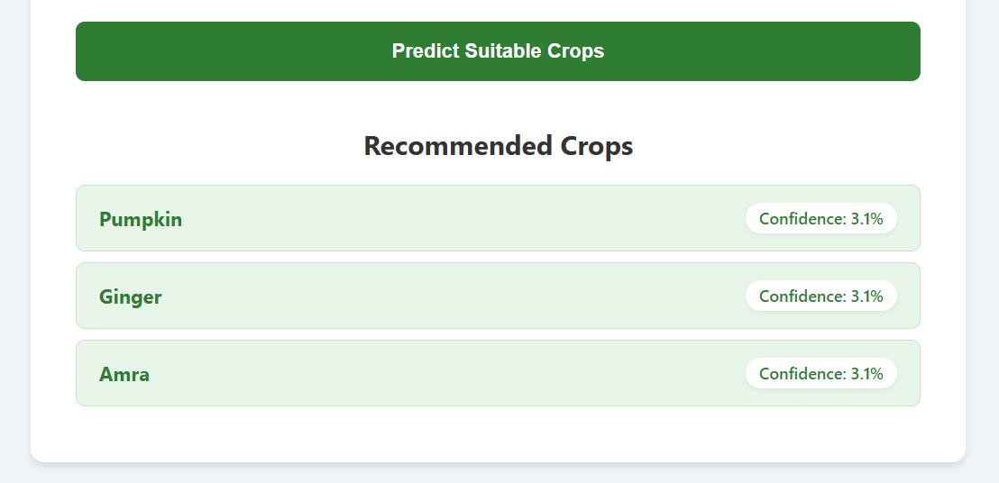

# Smart Crop Recommendation (MLOps)

An end-to-end, reproducible machine learning workflow for crop recommendation using a Bangladesh agricultural dataset (SPAS Dataset BD). The repository combines (i) a DVC-based data-to-metrics pipeline, (ii) model training with MLflow/DAGsHub tracking, and (iii) a deployable FastAPI application with a lightweight web UI.

## Abstract
Crop planning is a multi-factor decision problem in which agro-climatic conditions and regional characteristics jointly influence feasible and high-yield crop choices. This project presents a reproducible machine learning pipeline that ingests an agricultural dataset, performs systematic preprocessing (including temporal encoding of growth/harvest windows), trains a supervised classifier for crop recommendation, evaluates performance using standard classification metrics, and exposes the trained artifacts through a RESTful prediction service. The implementation emphasizes MLOps practices (experiment tracking and pipeline reproducibility) while remaining runnable as a conventional Python project.

## Figures (Project Overview)

*Figure 1. End-to-end workflow of the project (data -> pipeline -> model -> deployment).*  


*Figure 2. Proposed model block diagram (as used in the project report/notes).*  


*Figure 3. Accuracy comparison figure (as stored in the repository).*  


## Repository Structure

| Path | Purpose |
|---|---|
| `src/` | DVC pipeline stages: ingestion, preprocessing, feature engineering, split, train, evaluate |
| `data/raw/` | Raw dataset after ingestion (reproducible copy) |
| `data/processed/` | Processed dataset after cleaning and encoding |
| `data/featured/` | Feature-engineered dataset (currently a pass-through with NaN handling) |
| `data/splits/` | Train/test CSV splits used for training and evaluation |
| `models/` | Trained model artifacts generated by the pipeline |
| `metrics/` | Evaluation outputs (JSON metrics + confusion matrix) |
| `deployment/` | FastAPI service + static UI + deployment-time artifacts |
| `miscellaneous/` | Training notebook and the original dataset CSV |
| `images/` | Figures for documentation and UI screenshots |
| `dvc.yaml`, `dvc.lock` | DVC pipeline definition and locked stage dependencies |
| `params.yaml` | Model hyperparameters used by the training stage |

## Dataset

### Local Files in This Repository
- Primary dataset file used by the pipeline: `miscellaneous/SPAS-Dataset-BD.csv`
- Ingestion output (copied for reproducibility): `data/raw/SPAS-Dataset-BD.csv`

### Dataset Source (Internet)
The dataset included here is commonly distributed as **"SPAS Dataset BD"** and is available publicly via Mendeley Data. A related peer-reviewed article describing the dataset and methodology is available via ScienceDirect.

- Dataset repository (Mendeley Data): "SPAS Dataset BD" (CC BY 4.0).  
  Link: `https://data.mendeley.com/datasets/tszv6k3vky/1`  
  DOI: `10.17632/tszv6k3vky.1`
- Reference article (ScienceDirect): "SPAS: A Dataset for Smart Crop Prediction and Recommendation in Bangladesh".  
  Link: `https://www.sciencedirect.com/science/article/pii/S2352340923007535`  
  DOI: `10.1016/j.dib.2023.109756`

### Raw Schema (As Stored in `data/raw/`)
The raw CSV header in `data/raw/SPAS-Dataset-BD.csv` is:

```
Area,AP Ratio,District,Season,Avg Temp,Avg Humidity,Crop Name,Transplant,Growth,Harvest,Production,Max Temp,Min Temp,Max Relative Humidity,Min Relative Humidity
```

These fields encode agronomic factors (area, production, district, season) and climatic summaries (temperature/humidity), as well as temporal crop windows (transplant month and growth/harvest ranges).

## Methodology and Pipeline Design

This repository provides two complementary training paths:
1. **Reproducible DVC pipeline** (recommended for end-to-end reproduction): `dvc repro`
2. **Notebook-driven exploration/training** (for analysis and artifact creation): `miscellaneous/agriculture.ipynb`

### 1) Data Ingestion (`src/data_ingestion.py`)
The ingestion stage loads the dataset from `miscellaneous/SPAS-Dataset-BD.csv` and stores a reproducible copy at `data/raw/SPAS-Dataset-BD.csv`. Logging is written to `logs/data_history.log`.

### 2) Preprocessing (`src/preprocessing.py`)
The preprocessing stage is responsible for systematic cleaning and representation learning for temporal/categorical variables:

- Column normalization: whitespace trimming, lowercasing, and underscore formatting.
- Temporal encoding:
  - `Growth` and `Harvest` month ranges (e.g., "Jun to Oct") are transformed into **12-dimensional binary vectors** (`growth_jan` ... `growth_dec`, `harvest_jan` ... `harvest_dec`).
  - `Transplant` month is mapped to a month index `transplant_month in {0, ..., 11}`.
- Numeric conversion:
  - `area`, `production` cast to numeric; invalid rows dropped.
  - `ap_ratio` computed robustly as `area / production` with division-by-zero handling.
  - weather-related columns are cast to numeric where applicable.
- Categorical encoding:
  - `crop_name`, `season`, `district` are label-encoded to `crop_name_enc`, `season_enc`, `district_enc`.

Output: `data/processed/processed_data.csv`

### 3) Feature Engineering (`src/feature_engineering.py`)
This stage is implemented but currently configured as a conservative pass-through (it fills missing values and writes out the dataset). The file contains optional feature functions (weather interactions, polynomial features, district-level aggregates) that can be enabled by uncommenting the relevant lines in `FeatureEngineering.run()`.

Output: `data/featured/featured_data.csv`

### 4) Train/Test Split (`src/splitter.py`)
The split stage performs a stratified `train_test_split` using `crop_name_enc` as the target label. It writes:
- `data/splits/train.csv`
- `data/splits/test.csv`

### 5) Model Training (`src/model_training.py`)
The training stage fits a `RandomForestClassifier` on the training split. Hyperparameters are loaded from `params.yaml`:

```yaml
model_training:
  random_forest:
    n_estimators: 400
    max_depth: 31
    random_state: 42
    min_samples_split: 2
    min_samples_leaf: 5
    n_jobs: -1
```

Output model artifact: `models/random_forest_model.joblib`

#### Experiment Tracking (MLflow + DAGsHub)
`src/model_training.py` initializes DAGsHub tracking and sets an MLflow tracking URI. If you do not intend to log to DAGsHub (or do not have credentials), you may:
- comment out the `dagshub.init(...)` and `mlflow.set_tracking_uri(...)` lines, or
- configure your environment such that MLflow can authenticate to the configured tracking server.

### 6) Evaluation (`src/model_eval.py`)
The evaluation stage loads the trained model and computes:
- Accuracy
- Weighted precision/recall/F1
- Full classification report (per-class metrics)

Outputs:
- `metrics/evaluation_metrics.json`
- `metrics/confusion_matrix.png`

*Figure 4. Confusion matrix produced by the DVC evaluation stage.*  


## Results (From `metrics/evaluation_metrics.json`)
On the current repository state (as of the committed metrics artifact), the evaluation reports:
- Accuracy: **0.9631**
- Weighted Precision: **0.9678**
- Weighted Recall: **0.9631**
- Weighted F1: **0.9623**

For full per-class metrics, see `metrics/evaluation_metrics.json`.

## Reproducibility: Running the DVC Pipeline

### DVC Stage Graph (Conceptual)
The `dvc.yaml` pipeline is organized as a linear dependency chain:

```
miscellaneous/SPAS-Dataset-BD.csv
  |
  v
data_ingestion  ->  data/raw/SPAS-Dataset-BD.csv
  |
  v
preprocess      ->  data/processed/processed_data.csv
  |
  v
feature_engineering -> data/featured/featured_data.csv
  |
  v
split_data      ->  data/splits/{train.csv,test.csv}
  |
  v
train_model     ->  models/random_forest_model.joblib
  |
  v
evaluate_model  ->  metrics/evaluation_metrics.json + metrics/confusion_matrix.png
```

This structure supports reproducibility by ensuring that each artifact is deterministically derived from its declared dependencies and the parameter set in `params.yaml` (see `dvc.lock` for the last resolved dependency hashes).

### Prerequisites
- Python 3.10+
- (Recommended) A virtual environment (venv/conda)
- DVC (for pipeline orchestration)

### Install Dependencies (example)
This repository does not ship a pinned `requirements.txt`. A minimal set of packages inferred from the source code is:

```bash
pip install -U pandas numpy scikit-learn joblib pyyaml matplotlib seaborn dvc mlflow dagshub
```

If you use the deployment service:

```bash
pip install -U fastapi uvicorn pydantic
```

### Run End-to-End (DVC)
From the repository root:

```bash
dvc repro
```

This executes the pipeline stages in `dvc.yaml` and produces artifacts under `data/`, `models/`, and `metrics/`.

### Run Without DVC (Sequential Scripts)
If you prefer a direct Python workflow:

```bash
python src/data_ingestion.py
python src/preprocessing.py
python src/feature_engineering.py
python src/splitter.py
python src/model_training.py
python src/model_eval.py
```

### Logging and Auditability
Each stage writes a dedicated log file under `logs/` (e.g., `logs/preprocessing.log`, `logs/model_training.log`). These logs provide an execution trace that is useful for diagnosing schema issues (e.g., unexpected month formats) and for validating that each stage produced outputs of expected shapes.

## Training Notebook
The exploratory notebook used during development is:
- `miscellaneous/agriculture.ipynb`

This notebook contains model experimentation (including tree-based baselines such as Random Forest and gradient-boosting variants) and is the appropriate place to reproduce additional feature engineering and alternative models that may not be enabled in the DVC pipeline by default.

## Deployment (FastAPI + Static UI)
The deployment implementation is located in `deployment/` and is designed to be run as a self-contained service that:
1. Loads artifacts (model, encoders, scaler) on startup.
2. Exposes a `/predict` endpoint for crop recommendation.
3. Serves a static web UI from the same FastAPI server.

### Deployment Artifacts
The deployment currently expects the following files inside `deployment/`:
- `hybrid_model.joblib` (model)
- `label_encoders.joblib` (label encoders for district/season/target decoding)
- `scaler_area.joblib` (scaler for area-derived features)
- Optional: `model_features.joblib` or `cols_name.txt` (feature name list if the model does not expose `feature_names_in_`)

**Note:** The deployment artifacts are not the same as the DVC pipeline output model (`models/random_forest_model.joblib`). In practice, the deployment model (`hybrid_model.joblib`) is typically produced from the notebook workflow and stored under `deployment/`.

### Run the API Server
From the `deployment/` directory:

```bash
python main.py
```

The service runs at `http://127.0.0.1:8000/` and serves the UI (`index.html`) as the default page.

### Request Schema (`/predict`)
The FastAPI schema (`deployment/main.py`) defines the following JSON fields:

```json
{
  "district": "string",
  "season": "string",
  "area": 0.0,
  "transplant_month": "jan|feb|...|dec or full month name",
  "growth_period": "jun to oct",
  "harvest_period": "sep to nov",
  "min_temp": 0.0,
  "max_temp": 0.0,
  "min_relative_humidity": 0.0,
  "max_relative_humidity": 0.0
}
```

The API returns up to the **top-3** crop recommendations (when `predict_proba` is available) with associated probabilities.

### UI Screenshots
*Figure 5. Deployment UI: homepage.*  


*Figure 6. Deployment UI: example predictions (top recommendations).*  


## Notes on Feature Compatibility (Pipeline vs Deployment)
The DVC pipeline trains on the feature set generated by `src/preprocessing.py` (label-encoded categorical variables + month-range vectors + numeric features). The deployment service performs its own request-time preprocessing and uses a feature alignment step based on the trained model's feature list. If you retrain models and wish to deploy them, ensure that:
- the deployment preprocessing produces the same feature names and ordering used at training time, and
- the model artifact exposes feature names (preferred: `feature_names_in_`) or you provide them via `model_features.joblib` / `cols_name.txt`.

## Troubleshooting

- **`dvc repro` fails due to missing DVC installation:** install DVC with `pip install dvc`.
- **MLflow/DAGsHub errors during training:** disable remote tracking in `src/model_training.py` or configure credentials for the configured tracking URI.
- **Deployment fails at startup due to missing artifacts:** verify the expected artifact files exist in `deployment/` (model, encoders, scaler).
- **"Unknown district/season" at prediction time:** the input must match the label encoder classes saved in `deployment/label_encoders.joblib` (including spelling and casing expectations in that artifact).

## License
This repository is distributed under the terms described in `LICENSE`. The dataset itself may have its own license (Mendeley Data indicates CC BY 4.0 for "SPAS Dataset BD"); please verify licensing requirements before redistribution or commercial use.

## References (Suggested Citations)
If you use this dataset or project in academic work, cite the dataset and associated article:

```bibtex
@dataset{spas_dataset_bd,
  title        = {SPAS Dataset BD},
  publisher    = {Mendeley Data},
  doi          = {10.17632/tszv6k3vky.1},
  url          = {https://data.mendeley.com/datasets/tszv6k3vky/1}
}

@article{spas_dib_2023,
  title        = {SPAS: A Dataset for Smart Crop Prediction and Recommendation in Bangladesh},
  journal      = {Data in Brief},
  year         = {2023},
  doi          = {10.1016/j.dib.2023.109756},
  url          = {https://www.sciencedirect.com/science/article/pii/S2352340923007535}
}
```
