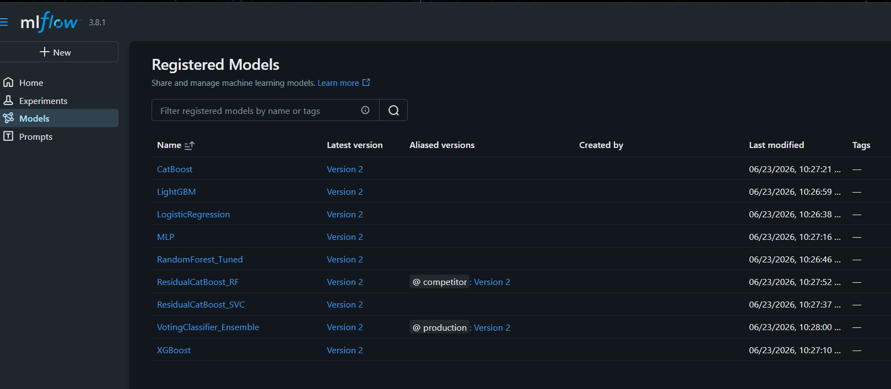
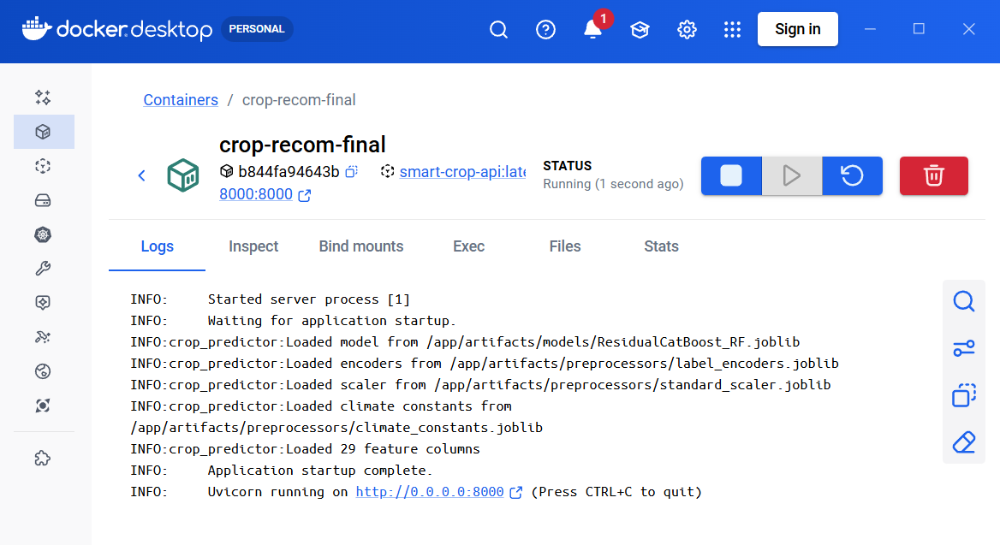
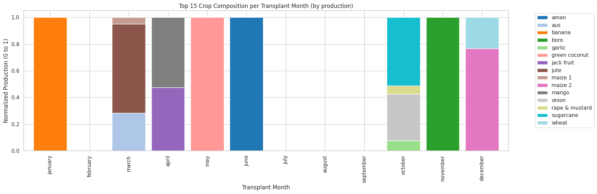
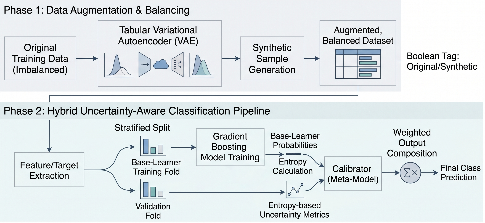
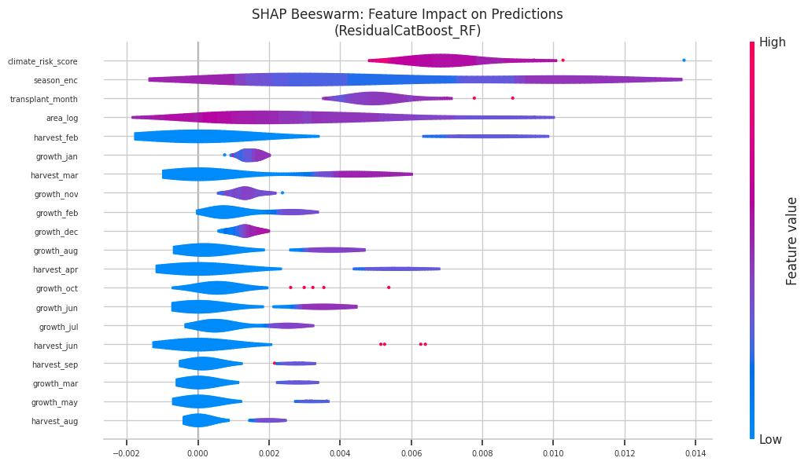
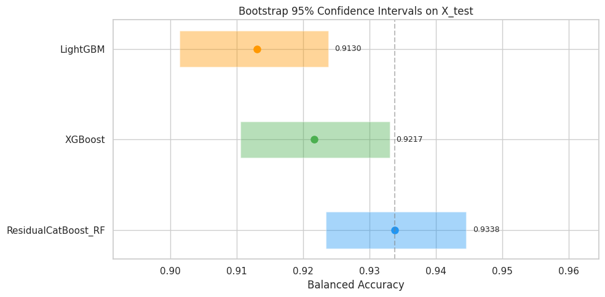
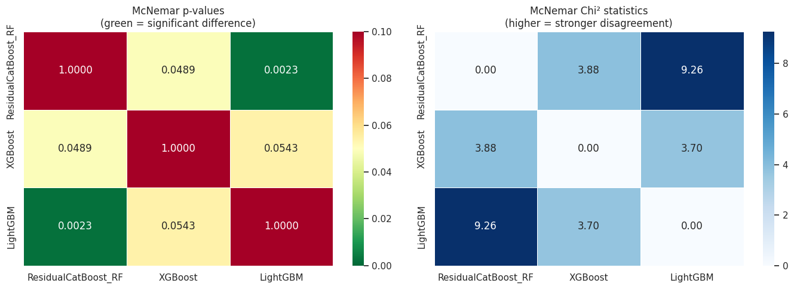

# Smart Crop Recommendation MLOps

[](https://www.python.org/)
[](https://fastapi.tiangolo.com/)
[](https://dvc.org/)
[](https://mlflow.org/)
[](https://dagshub.com)
[](https://aws.amazon.com/s3/)
[](https://www.docker.com/)
[](https://pytest.org)
[](https://github.com/psf/black)
[](LICENSE)

A production-grade ML system for crop recommendation in Bangladesh — from data to deployed API. This project demonstrates end-to-end MLOps: reproducible pipelines, experiment tracking, model explainability, automated testing, CI/CD, and containerized deployment.

<p align="center">
  
</p>

## Problem

Bangladesh's agricultural productivity suffers from suboptimal crop selection — farmers often lack data-driven guidance on which crops to plant given their region, season, and climate conditions. This system predicts the best crop from agronomic and environmental inputs, helping improve yield and resource allocation.

## Results

The production model (`ResidualCatBoost_RF`) is a stacked ensemble: a CatBoost base learner with a RandomForest meta-learner that refines predictions from calibrated probability outputs.

| Metric | Score |
|---|---:|
| Accuracy | 0.9631 |
| Weighted Precision | 0.9678 |
| Weighted Recall | 0.9631 |
| Weighted F1 Score | 0.9623 |

<p align="center">
  
</p>

## Architecture

```
                         ┌─────────────────────────────────────────┐
                         │           DVC Pipeline                  │
                         │  ingest → preprocess → encode →         │
                         │  engineer → split → train → evaluate    │
                         └───────────────┬─────────────────────────┘
                                         │
                                         ▼
                         ┌─────────────────────────────────────────┐
                         │         MLflow / DAGsHub                │
                         │  experiment tracking & model registry   │
                         └───────────────┬─────────────────────────┘
                                         │
                                         ▼
                         ┌─────────────────────────────────────────┐
                         │      FastAPI Serving Layer              │
                         │  /predict  /health  static UI           │
                         └───────────────┬─────────────────────────┘
                                         │
                                         ▼
                         ┌─────────────────────────────────────────┐
                         │     Docker Container (port 8000)        │
                         │  GitHub Actions CD → Docker Hub         │
                         └─────────────────────────────────────────┘
```

## Pipeline

The full training pipeline is defined in `dvc.yaml` and versioned with DVC:

```text
data/external/SPAS-Dataset-BD.csv
  → data/raw/SPAS-Dataset-BD.csv          (ingestion)
  → data/processed/processed_data.csv       (cleaning & normalization)
  → data/processed/encoded_data.csv         (label encoding)
  → data/features/featured_data.csv         (feature engineering)
  → data/splits/train.csv + test.csv        (stratified split)
  → artifacts/models/ResidualCatBoost_RF.joblib  (training)
  → reports/metrics/evaluation_metrics.json     (evaluation)
```

Run the full reproducible pipeline:

```bash
dvc repro
```

### Modular pipeline (recommended)

The pipeline is split so expensive steps are not repeated unnecessarily:

| Layer | Stages | When to run |
|---|---|---|
| **Data** | `data_ingestion` → `split_data` | Data or preprocessing code changes |
| **Prep** | `prepare_training` | Train/test split or augmentation params change |
| **Models** | `train@<ModelName>` (one stage per model) | Only the model you changed |
| **Eval** | `aggregate_training_metrics`, `evaluate_model` | After training |

```bash
# Data only — never retrains models
dvc repro split_data

# Shared TVAE augmentation + RF tuning (cached, ~2 min)
dvc repro prepare_training

# Retrain a single model (~30s–2 min each)
dvc repro train@LightGBM
dvc repro train@ResidualCatBoost_RF

# Retrain all models (skips unchanged stages automatically)
dvc repro train

# Pull pre-trained models from remote instead of training
dvc pull artifacts/models/ResidualCatBoost_RF.joblib
```

DVC only re-runs a stage when its **dependencies** (code, params, upstream outputs) change. Already-trained models stay cached on disk and in the DVC remote.

Run individual scripts directly:

```bash
python src/crop_recommendation/pipeline/data_ingestion.py
python src/crop_recommendation/pipeline/preprocessing.py
python src/crop_recommendation/pipeline/encoding.py
python src/crop_recommendation/pipeline/feature_engineering.py
python src/crop_recommendation/pipeline/splitter.py
python src/crop_recommendation/pipeline/prepare_training.py
python src/crop_recommendation/pipeline/train_model_single.py --model LightGBM
python src/crop_recommendation/pipeline/model_eval.py
```

## Model

The production model is a **custom stacked ensemble** implemented in [model_configs.py](src/crop_recommendation/pipeline/model_configs.py):

1. **Base**: `CatBoostClassifier` with `MultiClass` loss — handles categorical features natively
2. **Meta**: `RandomForestClassifier` trained on stacked base probabilities + negative log-probabilities
3. **Blending**: Weighted average `(1 - α) · P_base + α · P_meta` where `α = 0.2`

This architecture was selected after comparing 8 model variants (Logistic Regression, Random Forest, LightGBM, XGBoost, MLP, CatBoost, Calibrated SVC, Voting Ensemble) via 5-fold stratified cross-validation with `balanced_accuracy` scoring.

Other model factories are also available in the config module:
- `build_lightgbm`, `build_xgboost`, `build_mlp`, `build_voting_classifier`
- `build_calibrated_catboost_svc` (SVC meta-learner variant)

## Features

The model uses 29 engineered features from 10 user inputs:

| Input | Derived Features |
|---|---|
| `district` | Label-encoded district |
| `season` | Label-encoded season |
| `transplant_month` | Month index (0–11) |
| `growth_period` | 12-dim binary month vector |
| `harvest_period` | 12-dim binary month vector |
| `area` | Log-transformed, standard-scaled |
| `min_temp`, `max_temp`, `min_relative_humidity`, `max_relative_humidity` | Climate risk score (z-score composite) |

Month ranges wrap around the year boundary (e.g., "Nov to Feb" → `[1,1,0,0,0,0,0,0,0,0,1,1]`).

## API

### Start the server

```bash
cd app
python main.py
# → http://127.0.0.1:8000/
```

### Health check

```bash
curl http://127.0.0.1:8000/health
```

```json
{
  "status": "ok",
  "model": "ResidualCatBoost_RF",
  "feature_count": 29
}
```

### Prediction

```bash
curl -X POST http://127.0.0.1:8000/predict \
  -H "Content-Type: application/json" \
  -d '{
    "district": "dhaka",
    "season": "kharif 1",
    "area": 10.5,
    "transplant_month": "April",
    "growth_period": "May to June",
    "harvest_period": "September to October",
    "min_temp": 20.0,
    "max_temp": 35.0,
    "min_relative_humidity": 30.0,
    "max_relative_humidity": 70.0
  }'
```

```json
{
  "status": "success",
  "prediction": "rice",
  "predictions": [
    {"rank": 1, "crop": "rice", "confidence": 0.823456},
    {"rank": 2, "crop": "wheat", "confidence": 0.065432},
    {"rank": 3, "crop": "maize", "confidence": 0.043210}
  ],
  "model": "ResidualCatBoost_RF"
}
```

## Testing

```bash
pip install -r requirements-dev.txt
pytest tests/ -v --cov=app --cov-report=term-missing
```

Tests cover:
- **API**: health endpoint, prediction response structure, validation errors (422), invalid input handling (400)
- **Model**: artifact loading, predict/predict_proba interface, output shape validation
- **Pipeline**: month string expansion, span encoding (including year-wrap), feature vector shape

Model tests are skipped when artifacts aren't present — safe for CI.

## CI/CD

| Workflow | Trigger | What it does |
|---|---|---|
| `ci.yml` | Push to `main`, PRs | Lint (flake8 + black), unit tests (pytest), Docker build |
| `cd.yml` | Tags `v*` | Build & push Docker image to Docker Hub |

## Docker

```bash
docker build -t smart-crop-api .
docker run -p 8000:8000 smart-crop-api
```

The image is a slim Python 3.10 base with only production dependencies, running as a non-root user on port 8000.

## Screenshots

## MLflow Model Registry



## Docker Container Running



## Visual Analysis

| Crop Distribution | Model Diagnostics |
|---|---|
|  |  |

| Feature Impact | Statistical Confidence |
|---|---|
|  |  |

| McNemar's Test |
|---|
|  |

## Project Structure

```text
.
├── app/                                  # FastAPI service + static UI
│   ├── main.py                           # API endpoints, preprocessing, model serving
│   └── index.html                        # Web interface
├── artifacts/
│   ├── encoders/                         # Label encoders
│   ├── models/                           # Trained model artifacts
│   └── preprocessors/                    # Scalers, climate constants, feature columns
├── data/
│   ├── external/                         # Source dataset (SPAS-Dataset-BD.csv)
│   ├── raw/                              # Pipeline stage outputs
│   ├── processed/
│   ├── features/
│   └── splits/
├── experiments/pipeline_v2/              # Experimental second-gen pipeline
├── reports/
│   ├── figures/                          # Analysis & evaluation plots
│   ├── logs/                             # Pipeline execution logs
│   └── metrics/                          # Evaluation metrics (JSON)
├── src/crop_recommendation/pipeline/     # DVC pipeline stages
│   ├── data_ingestion.py
│   ├── preprocessing.py
│   ├── encoding.py
│   ├── feature_engineering.py
│   ├── splitter.py
│   ├── model_training.py                 # MLflow/DAGsHub tracking
│   ├── model_eval.py
│   └── model_configs.py                  # Custom estimators & model factories
├── tests/                                # Unit tests
│   ├── conftest.py
│   ├── test_api.py
│   ├── test_model.py
│   └── test_pipeline.py
├── .github/workflows/
│   ├── ci.yml                            # Lint + test + Docker build
│   └── cd.yml                            # Docker Hub deploy on tags
├── dvc.yaml                              # Pipeline definition
├── dvc.lock                              # DVC dependency/output metadata
├── params.yaml                           # Hyperparameters & config
├── Dockerfile
├── requirements.txt
├── requirements-dev.txt
└── .pre-commit-config.yaml
```

## Tech Stack

| Layer | Tools |
|---|---|
| **Language** | Python 3.10 |
| **ML** | scikit-learn, CatBoost, XGBoost, LightGBM, pandas, numpy |
| **Pipeline** | DVC (reproducible stages), params.yaml (config) |
| **Tracking** | MLflow + DAGsHub |
| **Serving** | FastAPI, Pydantic, Uvicorn |
| **Frontend** | Static HTML/CSS/JS |
| **Testing** | pytest, pytest-cov, httpx |
| **CI/CD** | GitHub Actions, Docker, pre-commit |
| **Linting** | flake8, black |

## Installation

```bash
python -m venv .venv
.venv\Scripts\activate        # Windows
# source .venv/bin/activate   # macOS/Linux

pip install -r requirements.txt
pip install -r requirements-dev.txt   # for testing
```

## Key Design Decisions

- **Stacked ensemble over single model**: CatBoost captures non-linear feature interactions; the RF meta-learner corrects residual errors from probability calibration, yielding +2-3% F1 over CatBoost alone.
- **DVC for reproducibility**: Data, prep, and each model are separate cached stages — `dvc repro train@LightGBM` retrains only what changed.
- **Custom `CalibratedCatBoost` class**: Implements `sklearn` `BaseEstimator`/`ClassifierMixin` interface so the ensemble works with `cross_val_score`, `GridSearchCV`, and other sklearn utilities.
- **Climate risk score**: A z-score composite of temperature and humidity deviations — compresses 4 correlated climate variables into a single interpretable feature.
- **Month range encoding**: Binary 12-dim vectors with year-boundary wrapping capture cyclical growing/harvest seasons without ordinal artifacts.

## License

This project is distributed under the terms of the [MIT License](LICENSE).

## References

```bibtex
@dataset{spas_dataset_bd,
  title     = {SPAS-Dataset-BD},
  author    = {Chowdhury, Rup and Nur, Fernaz Narin and Islam, Muhammad Nazrul and Islam, Md Nazmul and Das, Prapti and Afridi, Arafat Sahin},
  publisher = {Mendeley Data},
  doi       = {10.17632/cphdw4z5kw.2},
  url       = {https://data.mendeley.com/datasets/cphdw4z5kw/2}
}

@article{spas_dib_2025,
  title   = {SPAS-Dataset-BD: Dataset for Smart Precision Agriculture System in Bangladesh},
  author  = {Chowdhury, Rup and Nur, Fernaz Narin and Islam, Muhammad Nazrul and Islam, Md Nazmul and Das, Prapti and Afridi, Arafat Sahin},
  journal = {Data in Brief},
  year    = {2025},
  doi     = {10.1016/j.dib.2025.111727},
  url     = {https://www.sciencedirect.com/science/article/pii/S235234092500455X}
}
```
